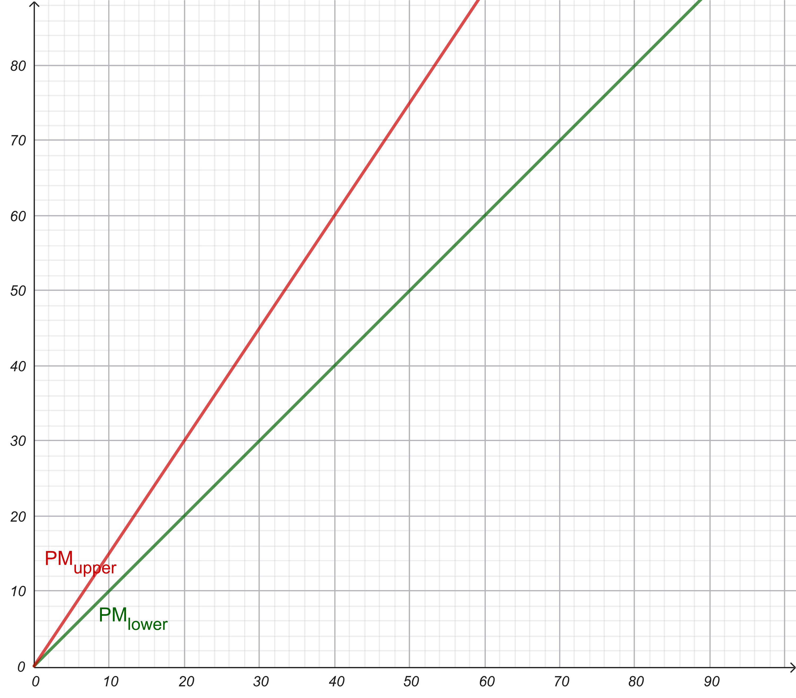

# Function-Points-Methode

## Function list

|  # | Function | FP type | Complexity | Weight (IFPUG) | Count | FP contribution |
| -: | - | -: | -: | -: | -: | -: |
| 1 | Create customer contact (type, date, topic, names, optional docs, remarks) | EI | Medium | 4 | 1 | 4 |
| 2 | Edit contact data | EI | Medium | 4 | 1 | 4 |
| 3 | Contact data database | ILF | Low | 7 | 1 | 7 |
| 4 | Customer data database | ILF | Low | 7 | 1 | 7 |
| 5 | Document references | EIF | Low | 5 | 1 | 5 |
| 6 | Display customer contacts | EQ | High | 6 | 1 | 6 |
| 7 | Report: revenue per customer (yearly) | EO | High | 7 | 1 | 7 |
| 8 | Report: total revenue per year (aggregated) | EO | High | 7 | 1 | 7 |
| 9 | Report: customers interest prediction | EO | High | 7 | 1 | 7 |
| 10 | Report: customers without contact in x months | EO | High | 7 | 1 | 7 |
|   | **Sum** |   |   |   |   | **61** |

## Influence of requirements

- 1 with critical influence
- 5 with strong influence
- 2 with medium influence
- 2 with low influence
- 4 no influence

| Influence | Einfluss | Count | Contribution |
| - | -: | -: | -: |
| Critical | 5 | 1 | 5 |
| Strong | 4 | 5 | 20 |
| Middle | 3 | 2 | 6 |
| Low | 2 | 2 | 4 |
| None | 0 | 4 | 0 |
| **Sum** |   |   | **30** |

## Value adjustment factor

$\text{Value Adjustment Factor} = (\text{Sum of influence contributions} * 0.01) + 0.65$

$\text{VAF} = (30 * 0.01) + 0.65 = 0.95$

## Adjusted Function Points

$\text{FP} = \text{Unadjusted FP} * \text{VAF}$
$\text{FP} = 61 * 0.95 = 57.95 \approx 58$

## Effort in person-months

10 FP = 10-15 PM

Lower estimate:
$58\text{ FP} * \frac{10\text{ PM}}{10\text{ FP}} = 58\text{ PM}$

Upper estimate:
$58\text{ FP} * \frac{15\text{ PM}}{10\text{ FP}}\approx 87\text{ PM}$

## Cost estimation

Assuming that 1 FP = 1020€

58 FP * 1020€ = 59160€

# b) FP / PM relationship

> x axis: Function Points (FP) \
y axis: Person Months (PM)

FP and PM have a linearly proportional relationship.
As FP increase, PM also increase by 1x to 1.5x.
The spread (1.0–1.5 PM per FP) shows variability in:
- actual project complexity
- past data used for calibration

## When is FP to PM conversion useful?

- Early in the project, when detailed task breakdowns are not yet available.
- When organization / company has data on past projects to calibrate FP to PM conversion.
- When comparing productivity across teams, technologies and projects.

..and when not?

- When there are many non-functional requirements (UX design, research, prototyping..)
- When productivity varies strongly between teams or technologies
- With very large teams, in which communication can be hard and time consuming.
